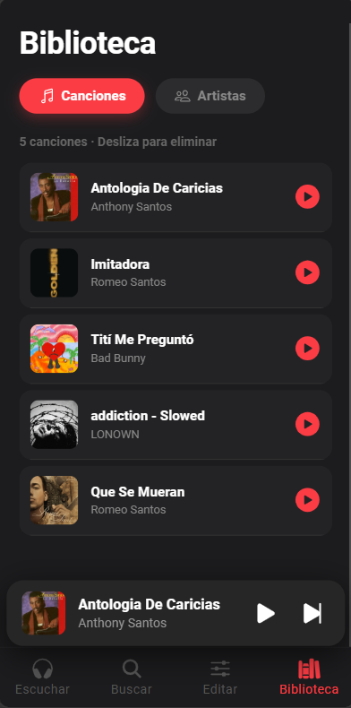
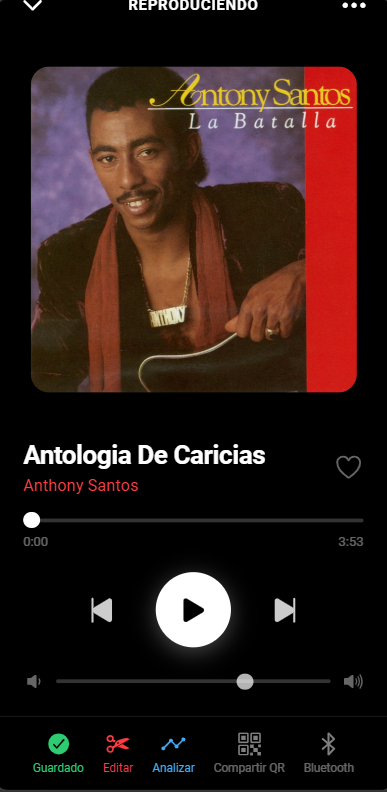
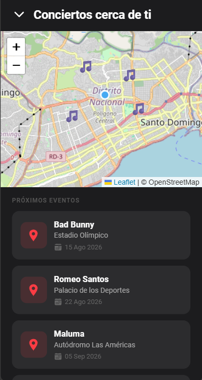
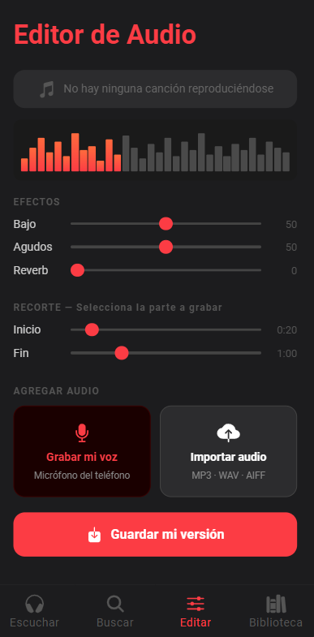
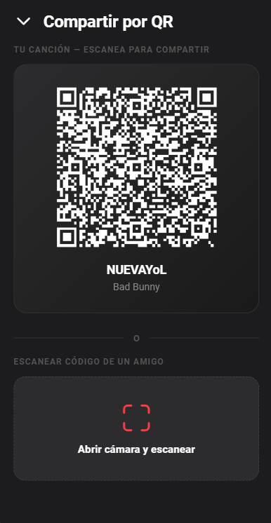
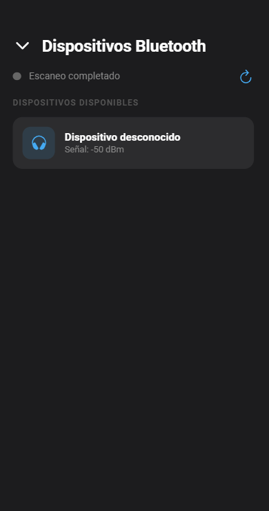

# UrMusic

Aplicación móvil híbrida de streaming, grabación y descubrimiento musical, desarrollada con Ionic + Angular + Capacitor. Permite explorar y reproducir canciones a través de la API de Spotify, grabar versiones propias mezclando voz e instrumental, guardar una biblioteca personal, descubrir conciertos cercanos en un mapa interactivo y conectarse a dispositivos de audio por Bluetooth.

## Tecnologías utilizadas

- **Framework:** Ionic 8 + Angular 20 (standalone components)
- **Empaquetado nativo:** Capacitor 8

**Plugins de Capacitor:**

| Plugin | Uso |
|---|---|
| `@capacitor/geolocation` | Obtener la ubicación GPS del usuario para el mapa de conciertos |
| `@capacitor/network` | Detectar el estado de conexión (online/offline) en tiempo real |
| `@capacitor-community/bluetooth-le` | Escanear y conectar dispositivos de audio Bluetooth (BLE) |
| `@capacitor-mlkit/barcode-scanning` | Escanear códigos QR para compartir canciones |

**Otras librerías:**
- `@ionic/storage-angular` — persistencia local de la biblioteca musical (IndexedDB)
- `leaflet` — mapa interactivo de conciertos cercanos
- `axios` — consumo de la API REST de Spotify
- `qrcode` — generación de códigos QR para compartir canciones
- Web Audio API (nativa del navegador) — grabación, mezcla y efectos de audio

## Instalación

```bash
git clone https://github.com/jhonnyalexander7/UrMusic.git
cd UrMusic
npm install
ionic serve
```

Requiere Node.js y el CLI de Ionic (`npm install -g @ionic/cli`) instalados previamente.

## Estructura del proyecto

```
UrMusic/
├── src/app/
│   ├── components/       # Componentes reutilizables (mini-player, network-banner)
│   ├── pages/             # Páginas de la app (library, artist, player, concerts, etc.)
│   ├── services/          # Servicios (spotify, library, bluetooth, geolocation, network...)
│   ├── tabs/               # Navegación por pestañas
│   └── tab1, tab2, tab3/  # Pestañas principales
├── src/assets/
└── src/theme/
```

## Capturas de pantalla

### Biblioteca


### Reproductor


### Mapa de conciertos


### Grabación de audio


### Escáner QR


### Dispositivos Bluetooth


## Funcionalidades por unidad del curso

| Unidad | Funcionalidad | Ubicación en el código |
|---|---|---|
| 1-2. Navegación | Tabs + lazy loading | `app.routes.ts`, `tabs.routes.ts` |
| 3. Interfaces y gestos | Swipe para eliminar, pull-to-refresh | `pages/library/` |
| 4. Conectividad | Detección de red online/offline | `services/network.ts` |
| 5. Bluetooth | Escaneo y conexión BLE | `services/bluetooth.ts` |
| 6. Geolocalización | GPS + mapa de conciertos | `services/geolocation.ts` |
| 7. Multimedia | Grabación y mezcla de audio | `services/audio-recorder.ts`, `services/audio-effects.ts` |
| 8. Cámara/QR | Escaneo de códigos QR | `services/qr-scanner.ts` |
| 9. Almacenamiento | Biblioteca persistente | `services/library.ts` |
| 10. Servicios web | Consumo de API REST de Spotify | `services/spotify.service.ts`, `services/spotify-auth.ts` |

## Equipo

Proyecto individual — **Jhonny Alexander de los Santos** (Matrícula: 100067208)
Asignatura: Programación de Dispositivos Móviles — ISW-307
Facilitador: Joan Manuel Gregorio Pérez
